# LeetCode Python Cheat Sheet

This cheat sheet is for interview prep through pattern recognition, not memorizing isolated solutions. The goal is to look at a problem, classify its structure, and reach a small set of likely tools quickly.

Use this as a review document:

- identify the pattern
- recall the core invariant
- drop in a clean template
- adapt for edge cases

## Pattern Selection Flowchart

```mermaid
flowchart TD
    A[Start with problem shape] --> B[Sorted array]
    A --> C[Subarray or substring]
    A --> D[Tree]
    A --> E[Graph or grid]
    A --> F[Linked list]
    A --> G[All permutations / subsets / combinations]
    A --> H[Top K / least K]
    A --> I[Max / min / count over choices]
    A --> J[Prefix / common string search]
    A --> K[In-place array transformation]

    B --> B1[Binary Search]
    B --> B2[Two Pointers]

    C --> C1[Sliding Window]
    C --> C2[Prefix Sum + HashMap]

    D --> D1[DFS]
    D --> D2[BFS]

    E --> E1[DFS]
    E --> E2[BFS]
    E --> E3[Dijkstra]
    E --> E4[Topological Sort]
    E --> E5[Union Find]

    F --> F1[Dummy Node]
    F --> F2[Fast / Slow Pointers]
    F --> F3[Pointer Reversal]

    G --> G1[Backtracking]

    H --> H1[Heap]
    H --> H2[QuickSelect]
    H --> H3[Bucket Sort]

    I --> I1[Dynamic Programming]
    I --> I2[Greedy]
    I --> I3[Sliding Window]
    I --> I4[Binary Search on Answer]

    J --> J1[HashMap]
    J --> J2[Trie]

    K --> K1[Two Pointers]
    K --> K2[Swap to Index]
    K --> K3[Reverse Sections]
```



## HashMap / Set

**Recognition**

- Need fast membership, counting, frequency matching, grouping, or deduplication
- Problem says "first unique", "two sum", "anagram", "seen before", or "count occurrences"

**Core Idea**

Use a hash-based structure to trade memory for `O(1)` average lookup and update.

**Python Template**

```python
from collections import defaultdict

def solve(nums):
    count = defaultdict(int)
    seen = set()

    for x in nums:
        count[x] += 1
        seen.add(x)

    for x in nums:
        if count[x] == 1:
            return x
    return -1
```

**Common LeetCode Problems**

- Two Sum
- Group Anagrams
- Contains Duplicate
- Valid Anagram
- Longest Consecutive Sequence
- Subarray Sum Equals K

**Common Mistakes**

- Using list lookup instead of set lookup
- Forgetting that dictionary keys must be hashable
- Overcounting when you only need membership

**One-Line Memory Rule**

If the problem needs fast lookup, counting, or grouping, start with `dict` or `set`.

## Two Pointers

**Recognition**

- Sorted array
- Palindrome checks
- Opposite-end shrinking
- In-place compaction or partitioning

**Core Idea**

Move two indices under a clear invariant instead of rechecking every pair.

**Python Template**

```python
def two_sum_sorted(nums, target):
    left, right = 0, len(nums) - 1

    while left < right:
        s = nums[left] + nums[right]
        if s == target:
            return [left, right]
        if s < target:
            left += 1
        else:
            right -= 1

    return [-1, -1]
```

**Common LeetCode Problems**

- Two Sum II
- Valid Palindrome
- 3Sum
- Container With Most Water
- Remove Duplicates from Sorted Array
- Trapping Rain Water

**Common Mistakes**

- Using two pointers on unsorted data without justification
- Moving both pointers when only one should move
- Forgetting duplicate skipping in `3Sum`

**One-Line Memory Rule**

If order matters and you can shrink from ends or scan in sync, think two pointers.

## Sliding Window

**Recognition**

- Subarray or substring
- Need longest, shortest, or count under a local constraint
- Window grows and shrinks while maintaining a condition

**Core Idea**

Maintain a valid window `[left, right]` and update it incrementally instead of recomputing from scratch.

**Python Template**

```python
from collections import defaultdict

def length_of_longest_substring(s):
    count = defaultdict(int)
    left = 0
    best = 0

    for right, ch in enumerate(s):
        count[ch] += 1

        while count[ch] > 1:
            count[s[left]] -= 1
            left += 1

        best = max(best, right - left + 1)

    return best
```

**Common LeetCode Problems**

- Longest Substring Without Repeating Characters
- Minimum Window Substring
- Permutation in String
- Longest Repeating Character Replacement
- Find All Anagrams in a String

**Common Mistakes**

- Forgetting whether the window condition should be valid or invalid inside the `while`
- Using sliding window when negatives break monotonic behavior
- Updating the answer before restoring validity

**One-Line Memory Rule**

For substring or subarray constraints that can be updated one step at a time, use a window.

## Prefix Sum + HashMap

**Recognition**

- Need count or existence of subarrays with exact sum
- Range sum queries
- Prefix difference trick
- Works especially well when negatives appear

**Core Idea**

If `prefix[j] - prefix[i] = target`, then earlier prefix values can be stored in a map.

**Python Template**

```python
from collections import defaultdict

def subarray_sum(nums, k):
    freq = defaultdict(int)
    freq[0] = 1
    prefix = 0
    ans = 0

    for x in nums:
        prefix += x
        ans += freq[prefix - k]
        freq[prefix] += 1

    return ans
```

**Common LeetCode Problems**

- Subarray Sum Equals K
- Continuous Subarray Sum
- Path Sum III
- Contiguous Array
- Range Sum Query

**Common Mistakes**

- Forgetting `freq[0] = 1`
- Using sliding window when negative numbers are present
- Mixing exact-sum logic with at-most logic

**One-Line Memory Rule**

Exact subarray sum often becomes prefix sum difference plus a hashmap.

## Stack

**Recognition**

- Need matching pairs
- Need undo of recent state
- Recursive structure can be simulated iteratively
- Problem asks for nested parsing or expression evaluation

**Core Idea**

Use LIFO order when the most recent unresolved item should be handled first.

**Python Template**

```python
def is_valid(s):
    pairs = {')': '(', ']': '[', '}': '{'}
    stack = []

    for ch in s:
        if ch in '([{':
            stack.append(ch)
        else:
            if not stack or stack[-1] != pairs[ch]:
                return False
            stack.pop()

    return not stack
```

**Common LeetCode Problems**

- Valid Parentheses
- Evaluate Reverse Polish Notation
- Decode String
- Simplify Path

**Common Mistakes**

- Forgetting empty-stack checks
- Using stack when simple counting is enough
- Popping too early when nested state matters

**One-Line Memory Rule**

If the last unresolved thing must be handled first, use a stack.

## Monotonic Stack

**Recognition**

- Next greater, next smaller, previous greater, previous smaller
- Histogram or span problems
- Want nearest boundary with monotonic relation

**Core Idea**

Maintain a stack that stays increasing or decreasing so each element is pushed and popped at most once.

**Python Template**

```python
def next_greater_elements(nums):
    res = [-1] * len(nums)
    stack = []  # stores indices, values decreasing

    for i, x in enumerate(nums):
        while stack and nums[stack[-1]] < x:
            res[stack.pop()] = x
        stack.append(i)

    return res
```

**Common LeetCode Problems**

- Daily Temperatures
- Next Greater Element I / II
- Largest Rectangle in Histogram
- Trapping Rain Water

**Common Mistakes**

- Storing values when indices are actually needed
- Choosing wrong monotonic direction
- Forgetting sentinel handling in histogram problems

**One-Line Memory Rule**

Nearest greater or smaller element usually means monotonic stack.

## Binary Search

**Recognition**

- Sorted search space
- Need first true, last true, minimum feasible, maximum feasible
- Answer itself can be searched by feasibility

**Core Idea**

Exploit monotonicity: if a condition becomes true, it stays true.

**Python Template**

```python
def first_true(lo, hi, check):
    while lo < hi:
        mid = (lo + hi) // 2
        if check(mid):
            hi = mid
        else:
            lo = mid + 1
    return lo
```

**Common LeetCode Problems**

- Binary Search
- Search Insert Position
- Search in Rotated Sorted Array
- Find Minimum in Rotated Sorted Array
- Koko Eating Bananas
- Capacity To Ship Packages Within D Days

**Common Mistakes**

- No clear monotonic predicate
- Infinite loop from wrong boundary updates
- Confusing index search with answer search

**One-Line Memory Rule**

If the search space is monotonic, binary search the boundary.

## Intervals

**Recognition**

- Start-end ranges
- Merge, overlap, meeting rooms, insert interval
- Need event ordering on segments

**Core Idea**

Sort by start time, then sweep and merge or count overlaps.

**Python Template**

```python
def merge(intervals):
    intervals.sort(key=lambda x: x[0])
    merged = []

    for start, end in intervals:
        if not merged or merged[-1][1] < start:
            merged.append([start, end])
        else:
            merged[-1][1] = max(merged[-1][1], end)

    return merged
```

**Common LeetCode Problems**

- Merge Intervals
- Insert Interval
- Non-overlapping Intervals
- Meeting Rooms
- Meeting Rooms II

**Common Mistakes**

- Forgetting to sort first
- Using `<=` vs `<` incorrectly for touching intervals
- Mutating intervals without understanding ownership

**One-Line Memory Rule**

Intervals usually start with sort, then sweep.

## Heap / Priority Queue

**Recognition**

- Repeated access to smallest or largest item
- Top K with streaming updates
- Merge sorted lists
- Best-first exploration

**Core Idea**

A heap gives `O(log n)` insert and pop of the smallest item. Use negatives for max-heap behavior.

**Python Template**

```python
import heapq

def top_k_frequent(nums, k):
    freq = {}
    for x in nums:
        freq[x] = freq.get(x, 0) + 1

    heap = []
    for num, count in freq.items():
        heapq.heappush(heap, (count, num))
        if len(heap) > k:
            heapq.heappop(heap)

    return [num for count, num in heap]
```

**Common LeetCode Problems**

- Kth Largest Element in an Array
- Top K Frequent Elements
- Merge K Sorted Lists
- Find Median from Data Stream
- Task Scheduler

**Common Mistakes**

- Forgetting Python `heapq` is a min-heap
- Using heap when one final selection would be cheaper with quickselect
- Pushing full objects when a smaller tuple would do

**One-Line Memory Rule**

If you need repeated best-item extraction, use a heap.

## QuickSelect

**Recognition**

- Need kth largest or kth smallest once
- Do not need full sorting
- Average-case performance is acceptable

**Core Idea**

Partition like quicksort, but recurse only into the side containing the target index.

**Python Template**

```python
import random

def find_kth_largest(nums, k):
    target = len(nums) - k

    def partition(left, right, pivot_index):
        pivot = nums[pivot_index]
        nums[pivot_index], nums[right] = nums[right], nums[pivot_index]
        store = left

        for i in range(left, right):
            if nums[i] < pivot:
                nums[store], nums[i] = nums[i], nums[store]
                store += 1

        nums[store], nums[right] = nums[right], nums[store]
        return store

    left, right = 0, len(nums) - 1
    while left <= right:
        pivot_index = random.randint(left, right)
        pivot_index = partition(left, right, pivot_index)
        if pivot_index == target:
            return nums[pivot_index]
        if pivot_index < target:
            left = pivot_index + 1
        else:
            right = pivot_index - 1
```

**Common LeetCode Problems**

- Kth Largest Element in an Array
- Top K Frequent Elements

**Common Mistakes**

- Forgetting kth largest vs kth smallest index conversion
- Worst-case behavior if pivot choice is poor
- Using quickselect when stable order is needed

**One-Line Memory Rule**

One kth-element query without full sorting often means quickselect.

## Linked List

**Recognition**

- Need node rewiring
- Remove nth, reverse, merge, detect cycle, reorder
- Dummy head or fast/slow pointers are natural

**Core Idea**

Pointer problems become easier with a dummy node, slow/fast runners, or local reversal blocks.

**Python Template**

```python
class ListNode:
    def __init__(self, val=0, next=None):
        self.val = val
        self.next = next

def reverse_list(head):
    prev = None
    curr = head

    while curr:
        nxt = curr.next
        curr.next = prev
        prev = curr
        curr = nxt

    return prev
```

**Common LeetCode Problems**

- Reverse Linked List
- Merge Two Sorted Lists
- Linked List Cycle
- Remove Nth Node From End of List
- Reorder List
- Reverse Nodes in k-Group

**Common Mistakes**

- Losing `next` before rewiring
- Forgetting dummy node for head deletion cases
- Using values instead of node references when identity matters

**One-Line Memory Rule**

Linked list bugs usually disappear with a dummy node and careful pointer saves.

## Tree DFS / BFS

**Recognition**

- Binary tree traversal
- Need depth, path, subtree info, level-order traversal, or serialization

**Core Idea**

DFS is natural for subtree return values. BFS is natural for level-by-level processing and shortest unweighted tree distance.

**Python Template**

```python
from collections import deque

class TreeNode:
    def __init__(self, val=0, left=None, right=None):
        self.val = val
        self.left = left
        self.right = right

def max_depth(root):
    if not root:
        return 0
    return 1 + max(max_depth(root.left), max_depth(root.right))

def level_order(root):
    if not root:
        return []

    q = deque([root])
    ans = []

    while q:
        level = []
        for _ in range(len(q)):
            node = q.popleft()
            level.append(node.val)
            if node.left:
                q.append(node.left)
            if node.right:
                q.append(node.right)
        ans.append(level)

    return ans
```

**Common LeetCode Problems**

- Maximum Depth of Binary Tree
- Binary Tree Level Order Traversal
- Diameter of Binary Tree
- Lowest Common Ancestor of a Binary Tree
- Path Sum
- Binary Tree Right Side View

**Common Mistakes**

- Mixing subtree return value with global answer logic
- Forgetting base cases
- Using BFS when recursive subtree composition is simpler

**One-Line Memory Rule**

Trees split naturally into subtrees, so start with DFS unless levels matter.

## Graph / Grid DFS/BFS

**Recognition**

- Islands, regions, rooms, components, reachability
- Grid neighbors or graph adjacency list
- Unweighted shortest path suggests BFS

**Core Idea**

Model states as nodes and legal moves as edges; traverse with DFS for exploration or BFS for shortest unweighted steps.

**Python Template**

```python
from collections import deque

def num_islands(grid):
    rows, cols = len(grid), len(grid[0])
    visited = set()

    def bfs(r, c):
        q = deque([(r, c)])
        visited.add((r, c))

        while q:
            x, y = q.popleft()
            for dx, dy in ((1, 0), (-1, 0), (0, 1), (0, -1)):
                nx, ny = x + dx, y + dy
                if 0 <= nx < rows and 0 <= ny < cols:
                    if grid[nx][ny] == '1' and (nx, ny) not in visited:
                        visited.add((nx, ny))
                        q.append((nx, ny))

    islands = 0
    for r in range(rows):
        for c in range(cols):
            if grid[r][c] == '1' and (r, c) not in visited:
                islands += 1
                bfs(r, c)

    return islands
```

**Common LeetCode Problems**

- Number of Islands
- Flood Fill
- Rotting Oranges
- Clone Graph
- Walls and Gates
- Pacific Atlantic Water Flow

**Common Mistakes**

- Marking visited too late and adding duplicates
- Using DFS recursion when depth may overflow
- Forgetting graph can be disconnected

**One-Line Memory Rule**

Grid or graph traversal starts with nodes, neighbors, visited, and a clear stop rule.

## Topological Sort

**Recognition**

- Directed acyclic dependency order
- "Can finish", "build order", "alien dictionary", "course schedule"

**Core Idea**

Nodes with indegree zero are available now; process them and reduce dependency counts.

**Python Template**

```python
from collections import defaultdict, deque

def topo_sort(num_nodes, edges):
    graph = defaultdict(list)
    indegree = [0] * num_nodes

    for u, v in edges:
        graph[u].append(v)
        indegree[v] += 1

    q = deque([i for i in range(num_nodes) if indegree[i] == 0])
    order = []

    while q:
        node = q.popleft()
        order.append(node)
        for nei in graph[node]:
            indegree[nei] -= 1
            if indegree[nei] == 0:
                q.append(nei)

    return order if len(order) == num_nodes else []
```

**Common LeetCode Problems**

- Course Schedule
- Course Schedule II
- Alien Dictionary
- Minimum Height Trees

**Common Mistakes**

- Applying topo sort to undirected graphs
- Forgetting cycle detection by result length
- Reversing edge direction accidentally

**One-Line Memory Rule**

Dependency order in a DAG usually means indegree queue.

## Dijkstra

**Recognition**

- Weighted shortest path with non-negative weights
- Grid with movement costs
- "Minimum effort", "minimum time", "network delay"

**Core Idea**

Always expand the currently cheapest reachable state first using a min-heap.

**Python Template**

```python
import heapq
from collections import defaultdict

def dijkstra(n, edges, start):
    graph = defaultdict(list)
    for u, v, w in edges:
        graph[u].append((v, w))

    dist = [float('inf')] * n
    dist[start] = 0
    heap = [(0, start)]

    while heap:
        curr_dist, node = heapq.heappop(heap)
        if curr_dist > dist[node]:
            continue

        for nei, w in graph[node]:
            new_dist = curr_dist + w
            if new_dist < dist[nei]:
                dist[nei] = new_dist
                heapq.heappush(heap, (new_dist, nei))

    return dist
```

**Common LeetCode Problems**

- Network Delay Time
- Path With Minimum Effort
- Cheapest Flights Within K Stops
- Swim in Rising Water

**Common Mistakes**

- Using BFS on weighted edges
- Forgetting stale heap entry checks
- Applying Dijkstra with negative weights

**One-Line Memory Rule**

Non-negative weighted shortest path means Dijkstra.

## Union Find

**Recognition**

- Connectivity under repeated unions
- Dynamic component merging
- Cycle detection in undirected graph
- Similarity grouping

**Core Idea**

Track component representatives with path compression and union by rank or size.

**Python Template**

```python
parent = list(range(n))
rank = [0] * n

def find(x):
    if parent[x] != x:
        parent[x] = find(parent[x])
    return parent[x]

def union(a, b):
    ra, rb = find(a), find(b)
    if ra == rb:
        return False

    if rank[ra] < rank[rb]:
        parent[ra] = rb
    elif rank[ra] > rank[rb]:
        parent[rb] = ra
    else:
        parent[rb] = ra
        rank[ra] += 1

    return True
```

**Common LeetCode Problems**

- Number of Connected Components in an Undirected Graph
- Redundant Connection
- Accounts Merge
- Number of Islands II
- Graph Valid Tree

**Common Mistakes**

- Forgetting path compression
- Rebuilding connectivity from scratch every time
- Using union find when directed ordering is actually required

**One-Line Memory Rule**

Repeated merge-and-query connectivity suggests union find.

## Backtracking

**Recognition**

- All permutations, subsets, combinations, partitions
- Need to generate all valid choices under constraints

**Core Idea**

Build a partial path, recurse on choices, then undo the choice.

**Python Template**

```python
def subsets(nums):
    ans = []
    path = []

    def dfs(i):
        if i == len(nums):
            ans.append(path[:])
            return

        path.append(nums[i])
        dfs(i + 1)
        path.pop()

        dfs(i + 1)

    dfs(0)
    return ans
```

**Common LeetCode Problems**

- Subsets
- Permutations
- Combination Sum
- Palindrome Partitioning
- N-Queens
- Word Search

**Common Mistakes**

- Forgetting to copy the path
- Forgetting to undo the state
- Missing pruning when constraints allow it

**One-Line Memory Rule**

Generate-all-choice problems usually mean choose, recurse, unchoose.

## Dynamic Programming

**Recognition**

- Best answer over many choices
- Overlapping subproblems
- State can be defined by index, capacity, position, or mask

**Core Idea**

Define state, transition, base case, and evaluation order. Memoization and tabulation are the same recurrence in different form.

**Python Template**

```python
def coin_change(coins, amount):
    dp = [amount + 1] * (amount + 1)
    dp[0] = 0

    for total in range(1, amount + 1):
        for coin in coins:
            if total - coin >= 0:
                dp[total] = min(dp[total], dp[total - coin] + 1)

    return dp[amount] if dp[amount] != amount + 1 else -1
```

**Common LeetCode Problems**

- Climbing Stairs
- House Robber
- Coin Change
- Longest Increasing Subsequence
- Partition Equal Subset Sum
- Edit Distance

**Common Mistakes**

- State definition is vague
- Wrong iteration order in 1D compression
- Forgetting whether transition depends on current row or previous row

**One-Line Memory Rule**

If brute force repeats the same subproblems, formalize state and transition.

## Greedy

**Recognition**

- Local best choice seems permanently safe
- Interval scheduling, jumps, merges, resource allocation
- Can prove staying ahead or exchange argument

**Core Idea**

Make the best immediate choice only when you can justify that it never blocks the optimal answer.

**Python Template**

```python
def can_jump(nums):
    farthest = 0

    for i, jump in enumerate(nums):
        if i > farthest:
            return False
        farthest = max(farthest, i + jump)

    return True
```

**Common LeetCode Problems**

- Jump Game
- Gas Station
- Merge Triplets
- Non-overlapping Intervals
- Partition Labels

**Common Mistakes**

- Choosing greedy without proof intuition
- Confusing greedy with DP on the same surface pattern
- Ignoring counterexamples with small test cases

**One-Line Memory Rule**

Greedy works when a local choice can be proved globally safe.

## Trie

**Recognition**

- Prefix search
- Dictionary of words
- Need prefix pruning or autocomplete behavior

**Core Idea**

Store characters along paths so shared prefixes reuse structure.

**Python Template**

```python
class TrieNode:
    def __init__(self):
        self.children = {}
        self.is_word = False

class Trie:
    def __init__(self):
        self.root = TrieNode()

    def insert(self, word):
        node = self.root
        for ch in word:
            if ch not in node.children:
                node.children[ch] = TrieNode()
            node = node.children[ch]
        node.is_word = True

    def search(self, word):
        node = self.root
        for ch in word:
            if ch not in node.children:
                return False
            node = node.children[ch]
        return node.is_word

    def starts_with(self, prefix):
        node = self.root
        for ch in prefix:
            if ch not in node.children:
                return False
            node = node.children[ch]
        return True
```

**Common LeetCode Problems**

- Implement Trie
- Word Search II
- Design Add and Search Words Data Structure
- Replace Words

**Common Mistakes**

- Using trie when a hashmap is enough
- Forgetting end-of-word marker
- Building huge tries when constraints are small

**One-Line Memory Rule**

Shared string prefixes at scale suggest a trie.

## Design Problems

**Recognition**

- Need a reusable data structure or API
- Operations have required time complexity
- Object state matters more than one-shot computation

**Core Idea**

Translate operations into the right underlying primitives: hashmap, doubly linked list, heap, deque, trie, or custom indexing.

**Python Template**

```python
class MyQueue:
    def __init__(self):
        self.in_stack = []
        self.out_stack = []

    def push(self, x: int) -> None:
        self.in_stack.append(x)

    def _move(self):
        if not self.out_stack:
            while self.in_stack:
                self.out_stack.append(self.in_stack.pop())

    def pop(self) -> int:
        self._move()
        return self.out_stack.pop()

    def peek(self) -> int:
        self._move()
        return self.out_stack[-1]

    def empty(self) -> bool:
        return not self.in_stack and not self.out_stack
```

**Common LeetCode Problems**

- LRU Cache
- Min Stack
- Implement Trie
- Insert Delete GetRandom O(1)
- Design Twitter
- Time Based Key-Value Store

**Common Mistakes**

- Ignoring required complexity per operation
- Choosing the right behavior but wrong internal structure
- Forgetting stale data cleanup in lazy structures

**One-Line Memory Rule**

Design questions are mostly about matching APIs to the right primitives.

## Mistake Log

### Sliding Window vs Prefix Sum

- Use sliding window when the window can be adjusted locally and validity changes predictably
- Use prefix sum when exact subarray totals matter, especially with negative numbers
- Memory cue: window for local constraints, prefix sum for exact cumulative math

### Stack vs Counter

- Use stack when order and nesting matter
- Use counter when only counts matter
- Memory cue: parentheses need a stack, frequencies need a counter

### BFS vs DFS for Shortest Path

- BFS gives shortest path in unweighted graphs
- DFS is for exploration, not shortest path by default
- Memory cue: shortest steps in unweighted graph means BFS

### Binary Search vs Two Pointers

- Use binary search on monotonic search spaces
- Use two pointers when you can move boundaries directly based on current comparison
- Memory cue: boundary search means binary search, paired scan means two pointers

### DP vs Greedy

- Use DP when local best is not obviously safe and multiple states matter
- Use greedy only when you can justify the local choice
- Memory cue: if you need proof, challenge the greedy instinct first

### Heap vs QuickSelect

- Use heap for repeated top-k maintenance or streaming data
- Use quickselect for one kth query on static data
- Memory cue: repeated best-item extraction means heap, one-shot kth means quickselect

### Tree DFS Return Value vs Global Answer

- Return values represent subtree information
- Global or outer-scope variables represent answers not naturally returned by one subtree alone
- Memory cue: ask whether the parent needs a value or the whole program needs an answer

## Problem Index

| Problem | Pattern |
|---|---|
| Two Sum | HashMap / Set |
| Group Anagrams | HashMap / Set |
| Longest Consecutive Sequence | HashMap / Set |
| Two Sum II | Two Pointers |
| 3Sum | Two Pointers |
| Container With Most Water | Two Pointers |
| Longest Substring Without Repeating Characters | Sliding Window |
| Minimum Window Substring | Sliding Window |
| Permutation in String | Sliding Window |
| Subarray Sum Equals K | Prefix Sum + HashMap |
| Contiguous Array | Prefix Sum + HashMap |
| Path Sum III | Prefix Sum + HashMap |
| Valid Parentheses | Stack |
| Decode String | Stack |
| Daily Temperatures | Monotonic Stack |
| Largest Rectangle in Histogram | Monotonic Stack |
| Search in Rotated Sorted Array | Binary Search |
| Koko Eating Bananas | Binary Search |
| Capacity To Ship Packages Within D Days | Binary Search |
| Merge Intervals | Intervals |
| Insert Interval | Intervals |
| Meeting Rooms II | Intervals / Heap |
| Top K Frequent Elements | Heap / QuickSelect |
| Kth Largest Element in an Array | Heap / QuickSelect |
| Merge K Sorted Lists | Heap |
| Reverse Linked List | Linked List |
| Remove Nth Node From End of List | Linked List |
| Reorder List | Linked List |
| Maximum Depth of Binary Tree | Tree DFS / BFS |
| Binary Tree Level Order Traversal | Tree DFS / BFS |
| Diameter of Binary Tree | Tree DFS / BFS |
| Lowest Common Ancestor of a Binary Tree | Tree DFS |
| Number of Islands | Graph / Grid DFS/BFS |
| Rotting Oranges | Graph / Grid BFS |
| Clone Graph | Graph / Grid DFS/BFS |
| Course Schedule | Topological Sort |
| Course Schedule II | Topological Sort |
| Alien Dictionary | Topological Sort |
| Network Delay Time | Dijkstra |
| Path With Minimum Effort | Dijkstra |
| Redundant Connection | Union Find |
| Accounts Merge | Union Find |
| Graph Valid Tree | Union Find |
| Subsets | Backtracking |
| Permutations | Backtracking |
| Combination Sum | Backtracking |
| House Robber | Dynamic Programming |
| Coin Change | Dynamic Programming |
| Longest Increasing Subsequence | Dynamic Programming |
| Jump Game | Greedy |
| Gas Station | Greedy |
| Partition Labels | Greedy |
| Implement Trie | Trie |
| Word Search II | Trie + Backtracking |
| LRU Cache | Design Problems |
| Insert Delete GetRandom O(1) | Design Problems |
| Time Based Key-Value Store | Design Problems |

## Final Review Rules

- Start by classifying the problem, not by recalling a specific problem number
- Write the invariant before coding if the pattern is not obvious
- Prefer simple templates you can explain out loud
- If stuck, ask which data structure makes the operation cheap
- If still stuck, reduce the problem to: search, count, merge, schedule, connect, or optimize
